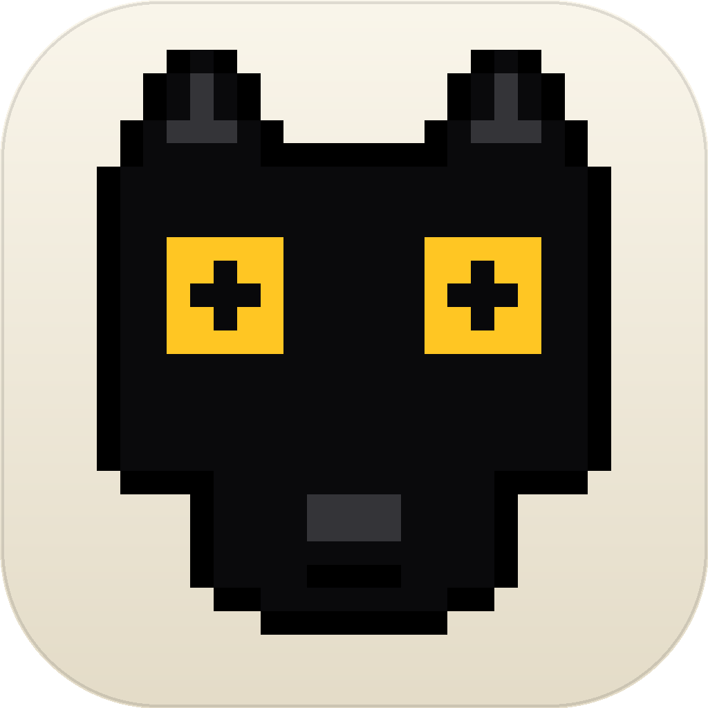

# asuTools

> 极简本地工具启动器 · macOS · PyQt6
> iTerm 风黑白主题 · 多环境识别 · 每工具独立绑定运行环境



---

## 为什么

红队 / CTF 工具箱常见两大痛点：

1. **环境地狱**：sqlmap 要 Python 3.11、某个 jar 要 JDK 8 + JavaFX、AntSword 要 GUI 模式、CyberChef 是 .html —— 每次都要去翻路径
2. **GUI 启动器要么丑、要么慢、要么夹带私货**（最常见的是国产渗透工具箱二开，带广告水印 + 无版权信息 + 闭源依赖）

asuTools 只做一件事：**作为一个干净的、可配置的、视觉极简的工具启动器**。本身不携带任何"工具集"，工具数据完全由你自己填。

## 特性

- **多环境识别**：自动扫描 `/usr/bin`、`/opt/homebrew`、`~/.local/bin`、conda envs、`~/.venvs`、`~/Workspace/**/Java_path` 下的 Python / venv / conda / Java，识别 **JavaFX** 支持
- **每工具独立环境**：编辑工具时下拉选环境；不选则用默认。FX 环境会自动排在前面
- **6 种工具类型**：`python` / `java` / `shell` / `gui` / `url` —— 不同类型对应不同启动方式（osascript 起 Terminal / `open` GUI / 浏览器开 URL）
- **iTerm 风极简 UI**：纯黑 / 纯白双主题，1px 分隔线，6px 圆角，无渐变无亚克力。颜色全在 `theme.py` 字典里改一处即全局生效
- **快捷键齐全**：⌘K 搜索 / ⌘N 新增 / ⌘E 编辑 / ⌘D 收藏 / ⌫ 删除 / ↵ 启动 / ⌘, 设置 / Esc 清搜
- **右键菜单**：每个工具支持启动 / 收藏 / 编辑 / 复制路径 / 删除
- **持久化**：所有数据 JSON 原子写入 `~/Library/Application Support/asuTools/`

## 截图

主窗口（iTerm 风暗色）和环境管理对话框分别见 `/tmp/asutools-shots/v0.png` 和 `settings.png`（生成命令：`uv run python scripts/screenshot.py`）

## 启动

### 从源码

```bash
git clone https://github.com/lsdogXG/asutools.git
cd asutools
uv sync --no-dev          # 只装运行时依赖（PyQt6）
uv run python -m asutools
```

### 装成 Mac 应用（Cmd+Space 唤醒）

```bash
uv run python scripts/make_app.py
# 装到 ~/Applications/asuTools.app，自动让 Spotlight 立刻索引
```

⌘+Space → `asu` 回车启动。

### 打 dmg

```bash
uv run python scripts/make_dmg.py
# 输出 dist/asuTools-0.1.0.dmg
```

> ⚠ 当前 dmg 是「轻量 launcher 壳」（~80KB），依赖本机源码路径 + 系统 `uv`。若要做**完全自包含可分发版**，需要 py2app 把 PyQt6 + Python 全打进去，体积 ~150MB+。

### 已知限制 · Dock 名字 = python3

macOS 通过 kernel API `proc_pidpath()` 拿进程真实可执行路径，由此决定 Dock 标签 / ⌘Tab 名字。因为我们的 Python binary 在 `.venv/bin/python3`，那个路径没有 `.app` 上级，所以 Mac fallback 到 "python3"。

代码里已经做了能做的事（应用图标通过 `NSApp.setApplicationIconImage_` 运行时设置，所以 Dock 图标是对的；进程 argv[0] 和 `setproctitle` 都改了），但 NSRunningApplication.localizedName 改不动。

**唯一根治办法是用 py2app 打成完全自包含的 bundle**（带 Python framework 进 `.app/Contents/`）。如果你需要分发给别人或在乎 Dock 标签，配置 py2app；否则忽略。

## 数据结构

所有数据都在 `~/Library/Application Support/asuTools/`：

```
asuTools/
├── tools.json          # 工具列表
├── categories.json     # 分类
├── environments.json   # 环境注册表 + 默认
└── settings.json       # 主题等
```

### 工具

```jsonc
{
  "id": "ab12cd34",
  "name": "sqlmap",
  "type": "python",                    // python / java / shell / gui / url
  "path": "/path/to/sqlmap.py",
  "args": "--batch",
  "category": "Web漏洞利用",
  "env_id": "venv-sqlmap",             // 不填则跟随默认
  "tags": ["sqli"],
  "description": "",
  "favorite": false,
  "last_used": 0
}
```

### 环境

```jsonc
{
  "environments": [
    {
      "id": "py-brew-3.12.7",
      "name": "Python 3.12.7 (brew)",
      "type": "python",                // python / venv / conda / java
      "path": "/opt/homebrew/bin/python3.12",
      "version": "3.12.7",
      "source": "auto",                // auto / user
      "tags": ["brew"],
      "javafx": false                  // Java 专用
    }
  ],
  "defaults": {
    "python": "py-brew-3.12.7",
    "java": "java-temurin-21"
  }
}
```

## 项目结构

```
asutools/                # 主包（~2300 行 Python）
├── __main__.py          # 入口：python -m asutools
├── paths.py             # 数据目录 & 旧版迁移
├── models.py            # Tool / Environment / Category dataclass
├── store.py             # JSON 原子读写
├── env_scanner.py       # 系统环境扫描（含 JavaFX 检测）
├── launcher.py          # 按 type+env 分发启动
├── theme.py             # DARK / LIGHT QSS
├── resources/
│   ├── icon.png         # 像素狗头 1024×1024
│   └── icon.icns        # 多分辨率 icns
└── ui/
    ├── main_window.py   # 主窗口 + 快捷键
    ├── sidebar.py       # 自绘 delegate 分类侧栏
    ├── grid.py          # QListView + delegate 工具列表 + 右键菜单
    └── dialogs.py       # ToolDialog / SettingsDialog

scripts/                 # 辅助脚本（dev only）
├── make_icon.py         # 生成像素狗 icon.png + icon.icns
├── make_app.py          # 打 ~/Applications/asuTools.app
├── make_dmg.py          # 打 dist/asuTools-x.y.z.dmg
├── bootstrap.py         # 从旧工具箱迁移数据（一次性）
├── detect_fx_tools.py   # 扫 jar 的 javafx 引用并自动绑环境
└── screenshot*.py       # Qt 自截图（无需录屏权限）
```

## 启动方式映射

| Type     | 行为                                                          |
|----------|---------------------------------------------------------------|
| `python` | `osascript` 新开 Terminal 跑 `<env-py> <path> <args>`           |
| `java`   | `osascript` 新开 Terminal 跑 `<env-java>/bin/java -jar <path>` |
| `shell`  | `osascript` 新开 Terminal 跑脚本                                |
| `gui`    | `open <path>`（.app / 单文件 / .html）                          |
| `url`    | 默认浏览器打开                                                  |

## 自定义

- **颜色 / 主题**：`asutools/theme.py` 顶部 `DARK` / `LIGHT` 字典
- **像素狗头**：`scripts/make_icon.py` 顶部 `PALETTE` 字典 + `make_dog_grid()` 里头/耳/眼/鼻的坐标常量
- **新增环境扫描位置**：`asutools/env_scanner.py` 的 `scan_python` / `scan_java` / `_scan_bundled_jdks`
- **新增工具类型**：`asutools/launcher.py` 加一个分支，再到 `dialogs.TOOL_TYPES` 注册

## 设计哲学

- **不夹带工具**：仓库零工具数据。工具是你的，启动器是工具。
- **不读不必要的目录**：环境扫描只看几个固定位置，不递归你的整个 home
- **不联网**：纯本地启动器，没有 telemetry
- **不混淆 / 不打包二进制**：所有源码 Python，可读可改
- **不替你写日志到工具**：launcher 把工具放进 Terminal 跑，工具自己输出由 Terminal 显示

## License

MIT
